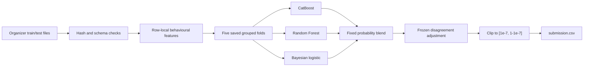

# Inter-Uni Datathon 2026 — Final Credit Default Submission

This repository is the complete finalist-review package for my Stream 1 credit-default solution. I entered as a single-person team. The repository contains my final modelling code, immutable validation folds, model configuration, saved artifacts, methodology report, disclosure, and the exact leaderboard prediction file.

## Final submission at a glance

| Item | Final value |
| --- | --- |
| Prediction file | [`submission.csv`](submission.csv) |
| Rows | 6,000 |
| SHA-256 | `a892ef4c5712ccd9da799c6a7710f3d0f7136c5bc8522ca61de5780d0ca6cfed` |
| Status | Byte-for-byte match to the user-confirmed best uploaded Kaggle file |
| Development replay OOF log loss | 0.421371 |
| Validation | Five immutable grouped folds, seed 2026 |
| Training data | Organizer-provided `train.csv` only |
| Final ensemble | CatBoost + Random Forest + Bayesian logistic |

The leaderboard score itself was not provided, so I do not invent or estimate it here. The reported 0.421371 is an out-of-fold development result, not a leaderboard score.

> [!IMPORTANT]
> **Why the earlier perfect-score file is not my final submission.** During exploration, I identified that the combined competition feature records corresponded to the 30,000-row UCI source table. My original design used exact source matches first and reserved the trained ensemble as fallback for unresolved rows. The completed row-level audit found 5,991 direct unambiguous source labels and resolved the remaining 9 by subtracting labelled training counts; the model fallback ultimately determined zero rows. I therefore classified that result as external-label reconstruction rather than model generalization and excluded it, especially because perfect-score entries are not eligible. The submitted `submission.csv` is the independently reproducible model-only ensemble. The full evidence is documented in [`METHOD.md`](METHOD.md#superseded-perfect-score-investigation) and [`docs/INTEGRITY_AUDIT.md`](docs/INTEGRITY_AUDIT.md).

## Reproduce the exact file

The cleanest review path is one command. It retrains all three branches from the organizer files in an isolated temporary directory, applies the frozen blend and disagreement layer, verifies the expected hash, and only then replaces the requested output.

### 1. Create the pinned environment

Python 3.13.2 was used for the verified run.

```bash
python3 -m venv .venv
source .venv/bin/activate
python -m pip install -r requirements.txt
```

### 2. Add the organizer files

Place these files in `data/raw/`:

- `train.csv`
- `test.csv`
- `sample_submission.csv`

Their SHA-256 fingerprints and schemas are checked before modelling. The files are not published in this repository; see [`data/raw/README.md`](data/raw/README.md).

### 3. Train, infer and verify

```bash
python scripts/reproduce_final_submission.py
python -m pytest -q
shasum -a 256 submission.csv
```

The final hash must be:

```text
a892ef4c5712ccd9da799c6a7710f3d0f7136c5bc8522ca61de5780d0ca6cfed
```

On the reference six-thread environment, full retraining takes about four minutes. Change the CPU limit with `--threads`; the script accepts negligible OOF replay noise only within the documented `2e-12` absolute tolerance, while the test component and final CSV must still match their exact hashes.

## How the solution works



Feature construction focuses on repayment-status severity and persistence, utilization, payment coverage, underpayment frequency, bill/payment changes, trends, volatility and a small set of domain-motivated interactions. It uses no labels, identifiers, target encoding or fitted population statistics. Undocumented demographic categories are treated as nominal, and no unsupported calendar or deployment interpretation is assumed.

| Branch | Core settings | Fixed base weight |
| --- | --- | ---: |
| CatBoost | depth 5, learning rate 0.035, L2 6, Bayesian bootstrap, 437-tree final fit | 0.564248 |
| Random Forest | 400 trees, `max_features=0.5`, `min_samples_leaf=30`, bootstrap, `max_samples=0.85` | 0.250365 |
| Bayesian logistic | behavioural representation, 5 knots, interaction splines, prior precision 60 | 0.185387 |

The exact recipes are in [`ensemble_config.json`](ensemble_config.json). The eight frozen disagreement coefficients, probability-clipping rule and final hash are in [`disagreement_config.json`](disagreement_config.json).

## Why this version was selected

| Candidate | OOF log loss | Decision |
| --- | ---: | --- |
| Logistic baseline | 0.434075 | Interpretable baseline |
| Fixed three-model blend | 0.421507 | Strong base ensemble |
| **Selected disagreement ensemble** | **0.421371** | **Final submission** |
| Seed-bagged challenger | 0.421138 | Rejected after worse competition-test result |
| Best nested full-refit policy | 0.421617 | Rejected; worse than current |

The seed-bagged candidate looked slightly better in local CV, but the user reported worse competition-test log loss. The selected file remains the best uploaded result that has been positively identified and matched locally. Full experimental context and limitations are in [`METHOD.md`](METHOD.md).

## Submission-material map

| Organizer requirement | Repository location |
| --- | --- |
| Final notebook / methodology report | [`METHOD.md`](METHOD.md) |
| Complete source code | [`scripts/`](scripts/) and [`src/`](src/) |
| Exact final prediction file | [`submission.csv`](submission.csv) |
| Processed / cleaned data | Generated in memory by [`src/archive_ensemble/features.py`](src/archive_ensemble/features.py) and [`src/archive_ensemble/features_v2.py`](src/archive_ensemble/features_v2.py); immutable fold assignments are committed in [`artifacts/saved_folds.csv`](artifacts/saved_folds.csv) |
| Reproduction instructions | This README and [`data/raw/README.md`](data/raw/README.md) |
| Final model information | [`METHOD.md`](METHOD.md), [`ensemble_config.json`](ensemble_config.json), [`disagreement_config.json`](disagreement_config.json) |
| Saved models and evaluation artifacts | [`artifacts/archive_ensemble_v1/`](artifacts/archive_ensemble_v1/) and [`artifacts/archive_disagreement_v2/`](artifacts/archive_disagreement_v2/) |
| Required disclosure | [`DISCLOSURE.md`](DISCLOSURE.md) |
| Organizer checklist | [`docs/SUBMISSION_RULES.md`](docs/SUBMISSION_RULES.md) |

No standalone cleaned feature table is required: preprocessing and feature generation are deterministic code paths and are regenerated during training. The saved folds are never recreated or silently repaired.

## Integrity notes

- No external dataset or external label is used to fit the final models.
- No test label or locked audit holdout is accessed.
- No prediction row is manually changed.
- The same `[1e-7, 1-1e-7]` clipping policy is applied to OOF and test probabilities.
- The source archive's external source-table label reconstruction and perfect-score path are excluded.
- Cross-validation estimates generalization; it does not guarantee leaderboard or deployment performance.

See [`DISCLOSURE.md`](DISCLOSURE.md) and [`docs/INTEGRITY_AUDIT.md`](docs/INTEGRITY_AUDIT.md) for provenance and integrity details.

## Repository structure

```text
submission.csv                         exact final leaderboard file
scripts/reproduce_final_submission.py one-command end-to-end reproduction
scripts/train_archive_ensemble.py     training, OOF validation and full-data refits
scripts/build_disagreement_submission.py final blend, post-processing and CSV output
src/archive_ensemble/                  feature and model implementations
artifacts/saved_folds.csv              immutable five-fold assignments
artifacts/archive_ensemble_v1/         component metrics, probabilities and models
artifacts/archive_disagreement_v2/     final-ensemble audit artifacts
METHOD.md                              methodology and model-selection report
DISCLOSURE.md                          required provenance disclosure
```

Research-only alternatives remain versioned for auditability, but they are not part of the final reproduction command and do not replace `submission.csv`.

## Final handoff

The repository has been verified as public. As the only team member, I should submit this repository and the exact root `submission.csv` once before midnight at the end of Sunday, 6 September 2026. If the exact numeric leaderboard score is available, I will add it to `METHOD.md` without regenerating or editing the prediction file.
